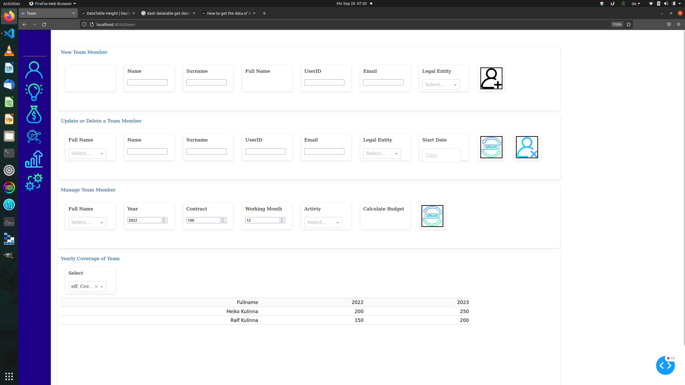
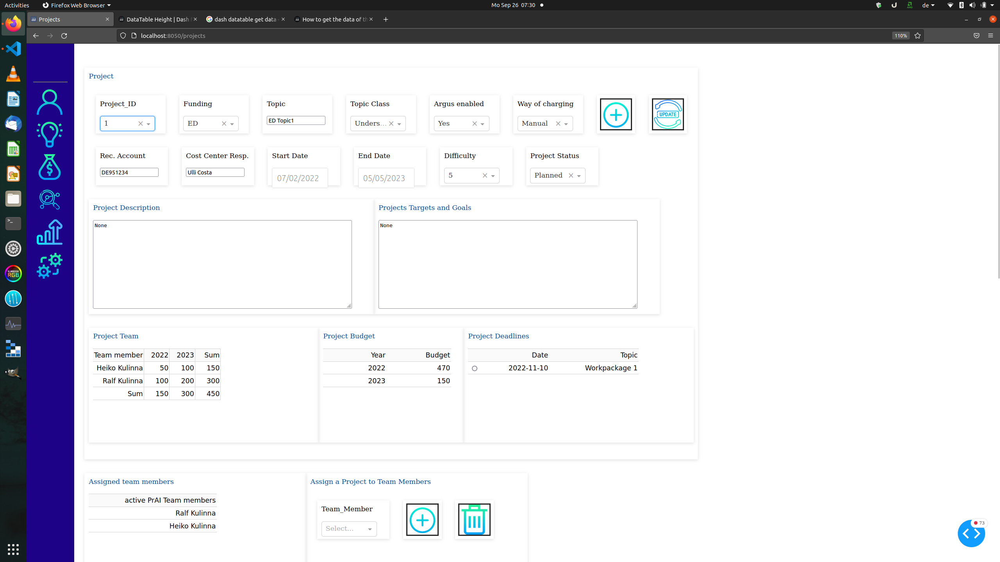
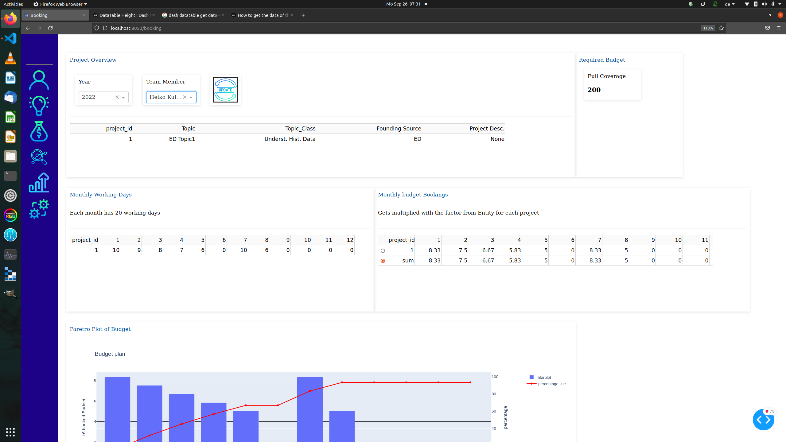
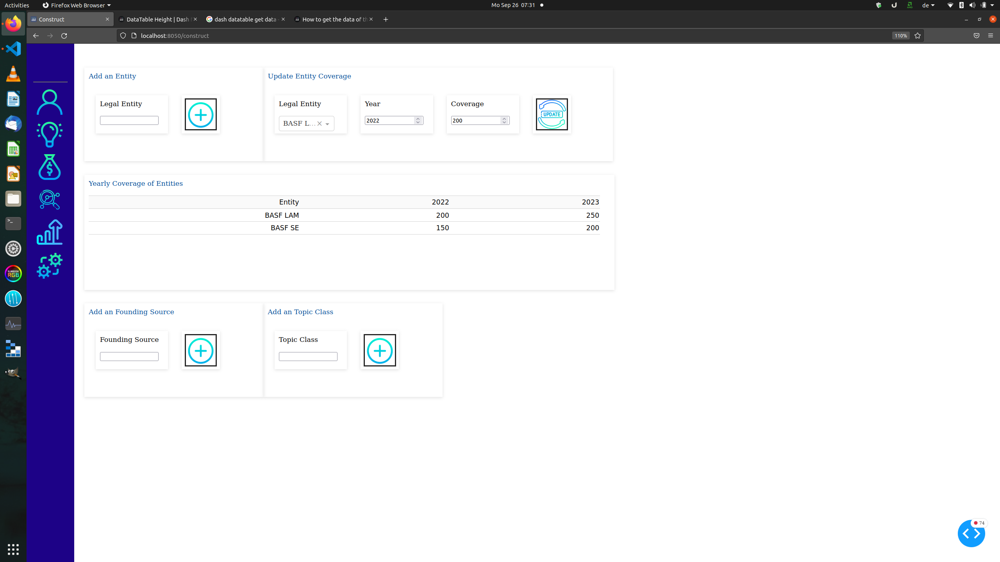
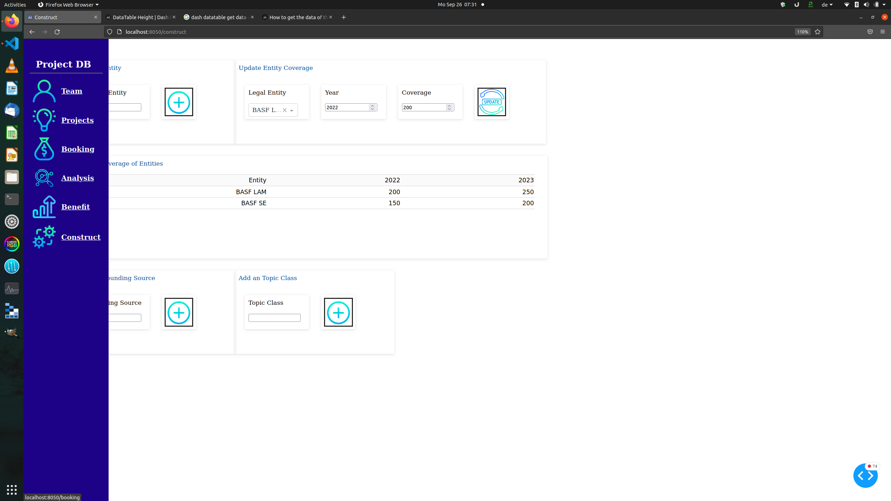

# postgres_app


I like to build up a dash app dockered to add and query a postgres database for project management












```bash 
python3 -m venv .venv

# switch manually to virtual environment and then

python3 -m pip install --upgrade pip

pip install poetry

poetry install 
# will install all dependencies from the pyproject.toml file
```


# Links
## Icons
https://www.flaticon.com/

Icons have been used from flaticon, from icon provider *Freepik* *bearicons*, . Thank you for this nice little art work.


## Box Shadows
getcsscan.com/css-box-shadow-examples


## Gradient CSS
https://cssgradient.io/


# POSTGRES
https://dba.stackexchange.com/questions/46410/how-do-i-insert-a-row-which-contains-a-foreign-key


