# postgres_app


## App Design

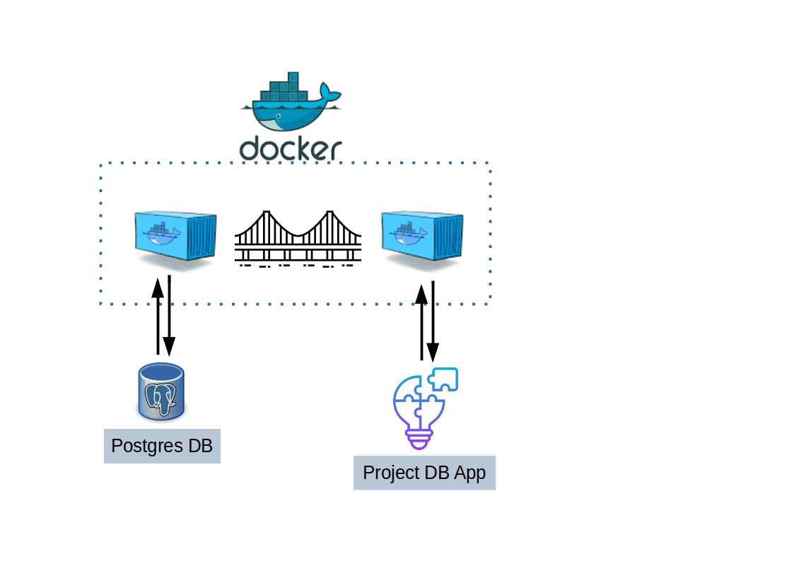

The Idea is to have a small Project Tracking Application, with a Postgres DB in the Background.
It is a project to replace a historical excel solution.

Now let's have deeper look into the design and front end of this application.


## App Frontend and Workflow

The Application will interact with the Postgres DB, so each Page has a specific function or topic to deal with.

First we need to add a few departments or legal entities where our employees work or belong to. We also can add the required average budget for the entity or department.


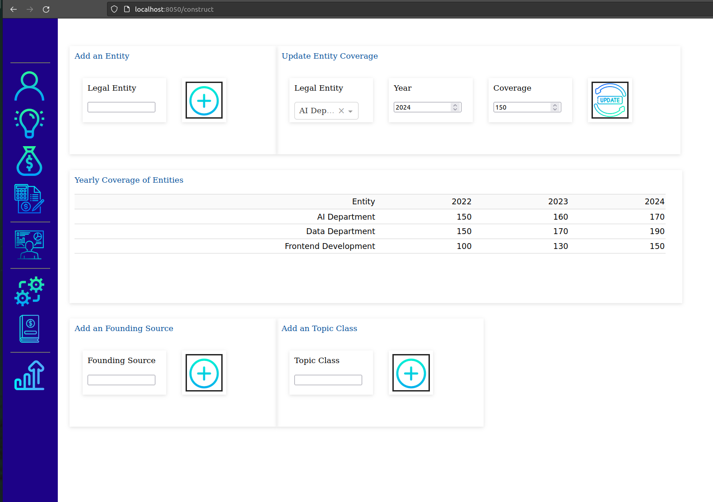

Here you also can add a founding source and Topic classes. Remember during the construction execution some topics and founding sources are already created.


After we have a department or entity, we also like to add new employees to these departments.

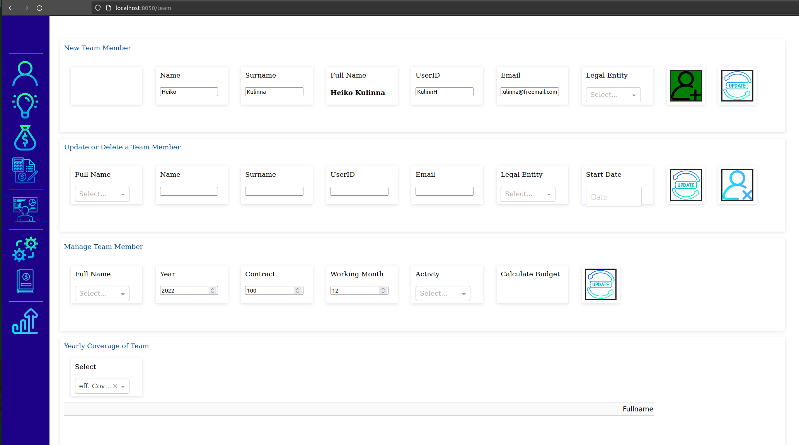

Now we also can add a new project. 

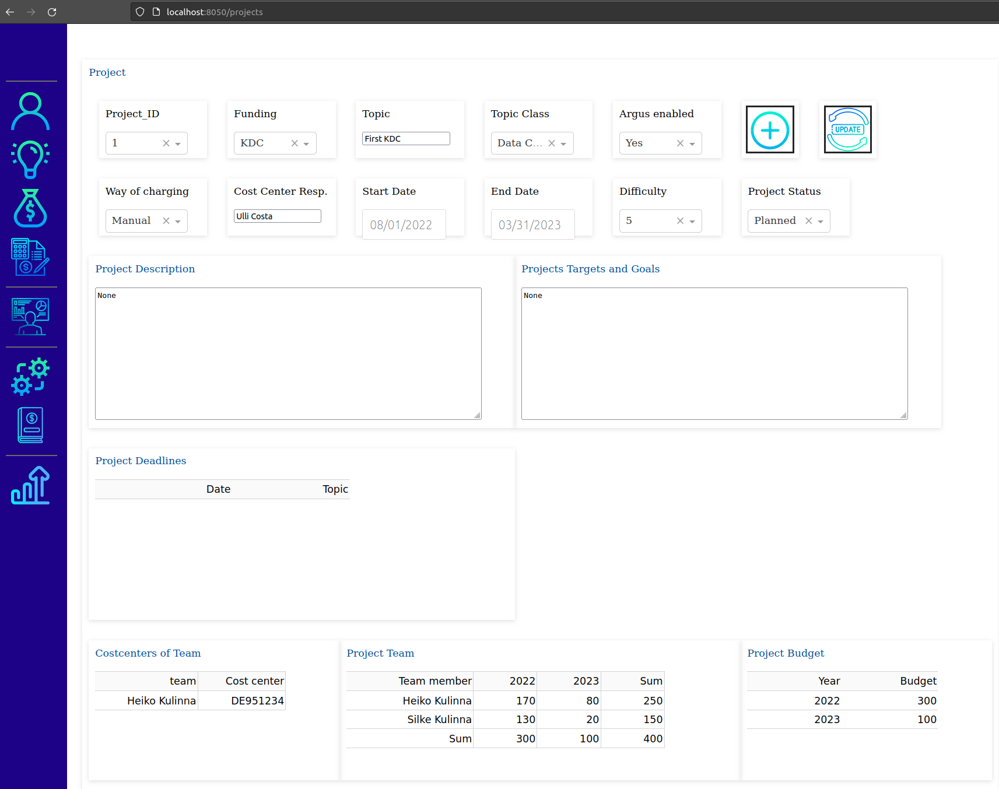

You need to add the funding source, a topi a topic class, way of charging, and some more.
You also can add a project description and also Targets and Goals.

You can assign team members and also team and personal budget.


When you really work on a project, you may like to book on the actual cost center your efforts. Select the year and the team membert. See all your projects and add your working days that you worked on. Based on these working days, the effective bookings based on your department costs, the money that needs to booked for your department is seen a specific table. 
Please see the bookings over time and the total bookings compaired to the total yearly required budget.

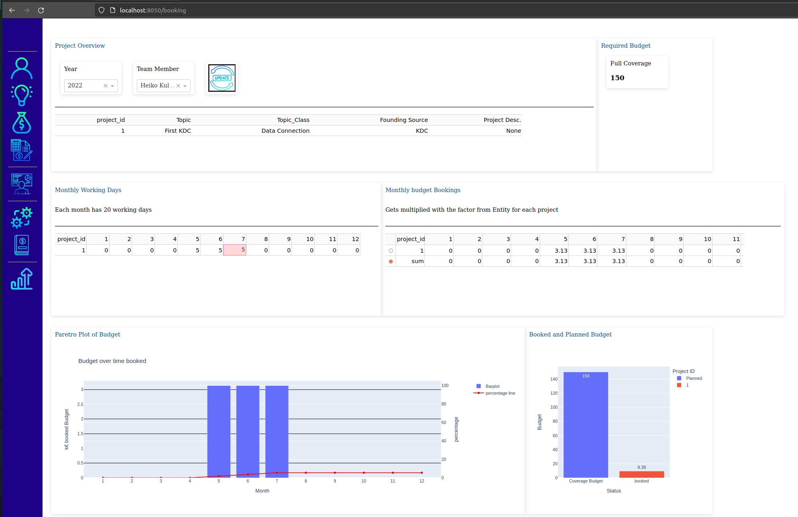

Based on all projects for a year the projects that are approved, ongoing and completed will summarized for the total budget and the required money based on your employees.

There is also a graphic when a project starts and who is working in parrallel on these projects. Projects get separated via swimlanes. The black line showing todays date as comparison.

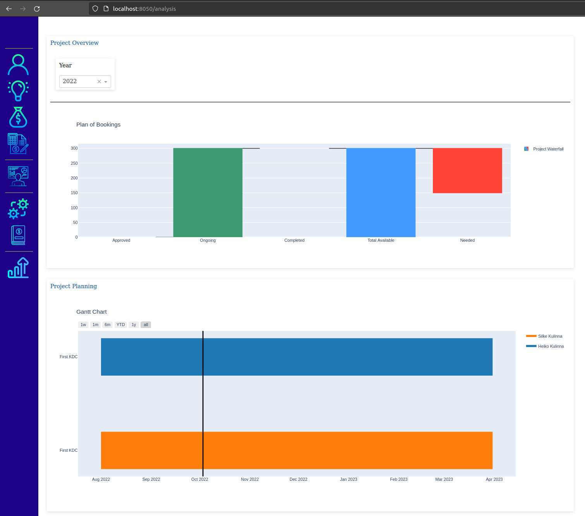


To be honest, I have a nice controller, who likes to make the booking via SAP to our internal customers, so i designed a possible controlling table. Which costcenter for which project with which costs should be booked, which also can be aggregated to remove the project team members and summarize for a costcenter. This table can be downloaded.
A Table for missing Costcenters is also included. Hope this is sufficient for my controller.
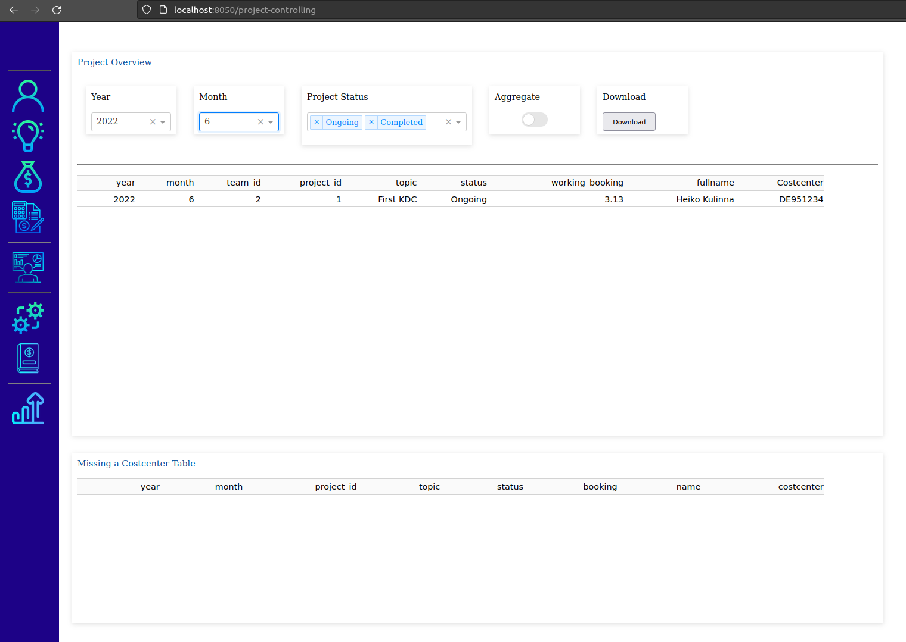


## Manual Work for developing

Based on the pdadmin interface it is possible to connect to the `postgres` Container and create a database called `teams`

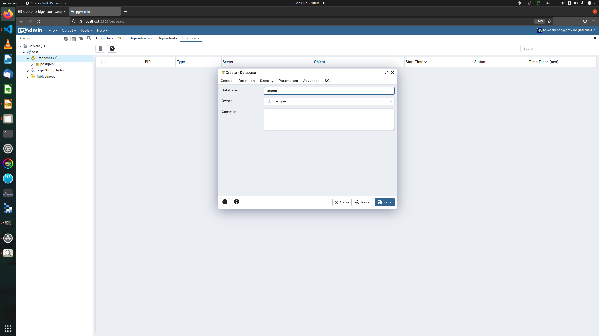

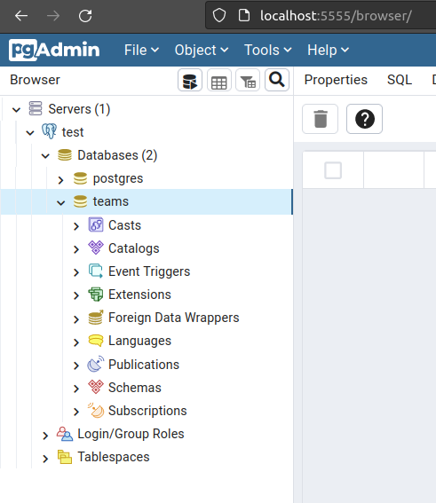

Within the construc_tables folder is a `construction.py` file. This needs to be executed only once the "teams" database have been setup.

It creates all the small tables that are needed and later queried to run the application.
Please execute it `sql` command for `sql` command and see it growing inp `pgadmin`.

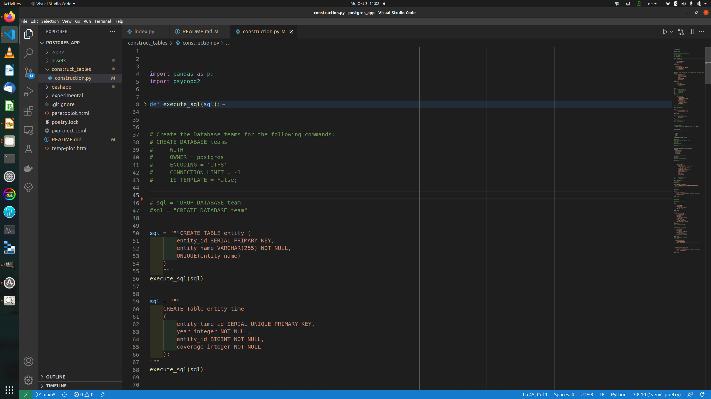


## Dash App Architecture

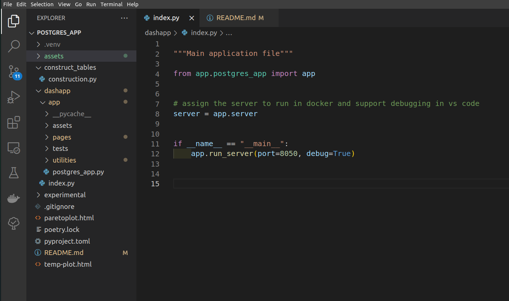

The Idea is to have an index file to execute and have all pages running. Each level of app easy to understand (- hopefully).

In the next level within the dashapp/app folder the `postgres_app.py` file is for the design of all pages and the sidebar

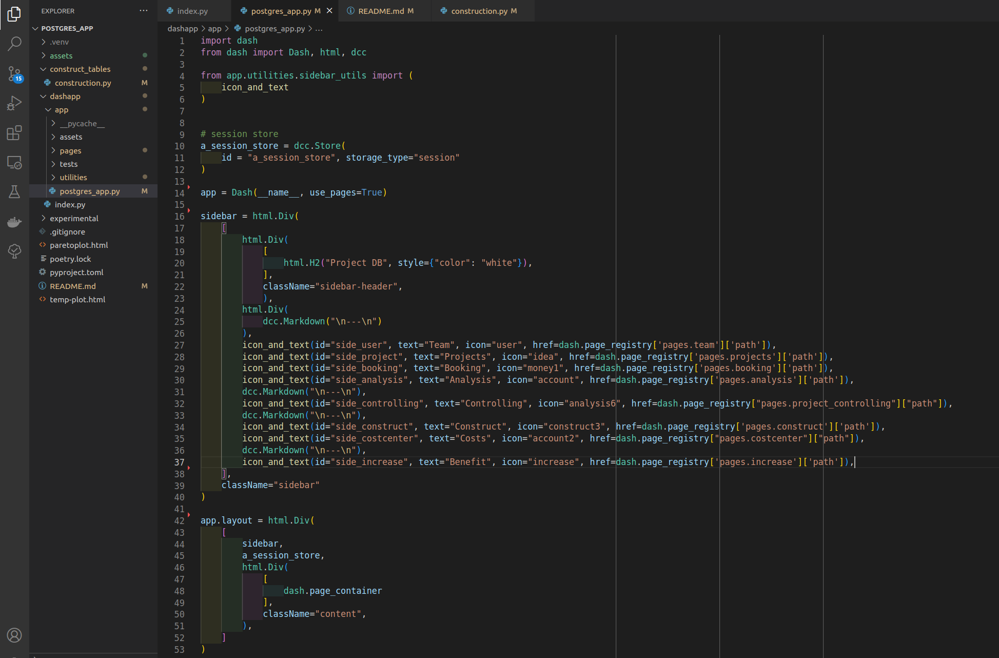


## Backend 

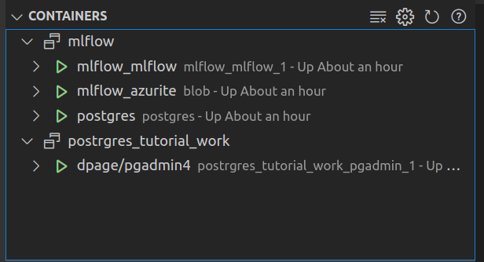

Based on former projects (mlflow see Tutorials in my git repos). As you see a `postgres` Container is already running on my computer. So I decided to use it for the local development. 
The postgres DB container is open on the port for external connections.

```bash 

    import psycopg2

    #establishing the connection
    conn = psycopg2.connect(
        database="teams",
        user='postgres',
        password='postgres',
        host='127.30.0.1',
        port= '5432'
    )
    conn.autocommit = True

```


## How to work locally 

```bash 
python3 -m venv .venv

# switch manually to virtual environment and then

python3 -m pip install --upgrade pip

pip install poetry

poetry install 
# will install all dependencies from the pyproject.toml file
```


# Current Status of the project

Frontend is not dockered yet. In this repo is no docker container yet. I will add it in the next days when i'm happy with the frontend. Maybe a docker compose for postgres, pgadmin and the frontend :)


# Links for construction and small little helpers

## Instagram Coders and project ideas
 - kyngcoder: Idea for Sidebar implementation
 - code_tune: How to create SQL Joins

## Icons
https://www.flaticon.com/

Icons have been used from flaticon, from icon provider *Freepik* and *bearicons*. Thank you for this nice little artwork that enabled this project.


## Box Shadows
https://getcsscan.com/css-box-shadow-examples


## Gradient CSS
https://cssgradient.io/

https://purecss.io


## Dash
https://dash.plotly.com/dash-core-components

https://dash.plotly.com/dash-html-components

https://dash.plotly.com/datatable


## POSTGRES

https://www.postgresqltutorial.com/postgresql-python/connect/

https://dba.stackexchange.com/questions/46410/how-do-i-insert-a-row-which-contains-a-foreign-key


## hexagon

https://blog.avada.io/css/hexagons

https://css-tricks.com/hexagons-and-beyond-flexible-responsive-grid-patterns-sans-media-queries/


